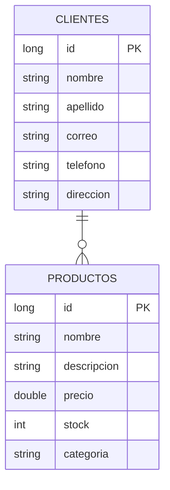

# 🚀 Tienda API - Backend Service

Este es un servicio RESTful robusto construido con **Java 21** y **Spring Boot 3**. Diseñado bajo una arquitectura de capas (Controller-Service-Repository) para garantizar un código modular, mantenible y escalable.

## 🛠 Tecnologías Utilizadas

* **Java 21**
* **Spring Boot 3.x**
* **Spring Data JPA** (Persistencia)
* **PostgreSQL** (Base de datos relacional)
* **Maven** (Gestión de dependencias)
* **Docker** (Contenedor de infraestructura)

## 📊 Modelo de Datos (Base de Datos)

El sistema gestiona dos entidades principales. A continuación se muestra la estructura relacional:

🏗 ArquitecturaEl proyecto sigue el Patrón de Capas:Controller: Exposición de endpoints REST y validación de entrada.Service: Lógica de negocio y orquestación.Repository: Comunicación directa con PostgreSQL usando JPA.Mapper: Conversión segura entre Entidades y DTOs (Data Transfer Objects).🚀 Instalación y EjecuciónRequisitosJDK 21 instalado.Docker Desktop ejecutándose.Pasos para iniciarClonar el repositorio:Bashgit clone <tu-url-de-repositorio>
cd tienda-api
Levantar PostgreSQL:Bashdocker-compose up -d
Ejecutar la API:Bash./mvnw spring-boot:run
🔌 Endpoints PrincipalesMétodoEndpointDescripciónPOST/clientesCrear clienteGET/clientesListar clientesDELETE/productos/{id}Eliminar producto
