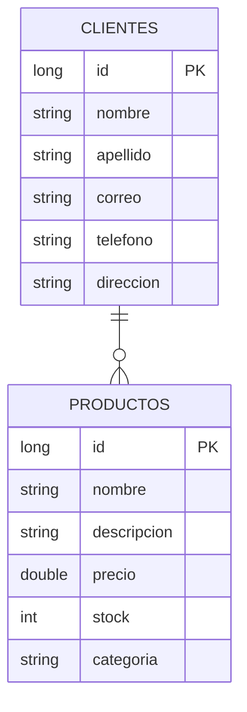

# 🚀 Tienda API - Backend Service

Este es un servicio RESTful robusto construido con **Java 21** y **Spring Boot 3**. Diseñado bajo una arquitectura de capas (Controller-Service-Repository) para garantizar un código modular, mantenible y escalable.

## 🛠 Tecnologías Utilizadas

* **Java 21**
* **Spring Boot 3.x**
* **Spring Data JPA** (Persistencia)
* **PostgreSQL** (Base de datos relacional)
* **Maven** (Gestión de dependencias)
* **Docker** (Contenedor de infraestructura)

## 📊 Modelo de Datos



## 🏗 Arquitectura
El proyecto sigue el **Patrón de Capas**, asegurando la separación de responsabilidades:


* **Controller:** Exposición de endpoints REST y validación de entrada.
* **Service:** Lógica de negocio y orquestación.
* **Repository:** Comunicación directa con PostgreSQL usando JPA.
* **Mapper:** Conversión segura entre Entidades y DTOs.

## 🚀 Instalación y Ejecución

### Requisitos previos
* **JDK 21** instalado.
* **Docker Desktop** ejecutándose.

### Pasos para iniciar
1. **Clonar el repositorio:**
   ```bash
   git clone <URL_DE_TU_REPOSITORIO>
   cd tienda-api
   ```
2. **Levantar PostgreSQL:**
   ```bash
   docker-compose up -d
   ```
3. **Ejecutar la API:**
   ```bash
   ./mvnw spring-boot:run
   ```

### 3. Endpoints Principales
Para esto, **una tabla es la mejor opción**. Es mucho más legible que una lista simple.

```markdown
## 🔌 Endpoints Principales

| Método | Endpoint | Descripción |
| --- | --- | --- |
| `POST` | `/clientes` | Crear cliente |
| `GET` | `/clientes` | Listar clientes |
| `GET` | `/clientes/{id}` | Buscar cliente por ID |
| `DELETE` | `/productos/{id}` | Eliminar producto |
